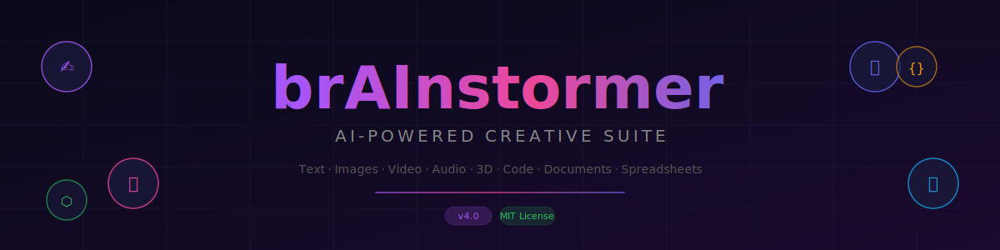
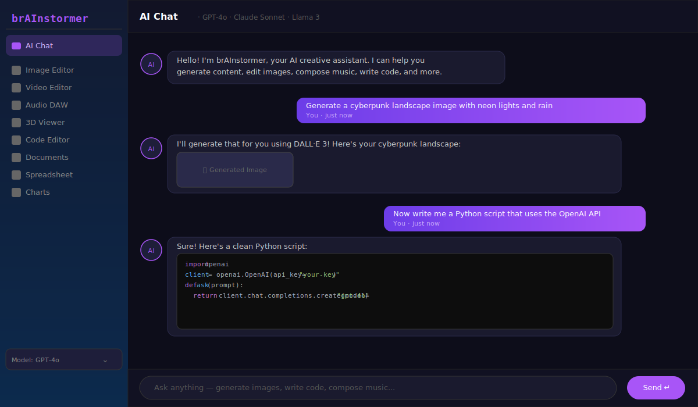
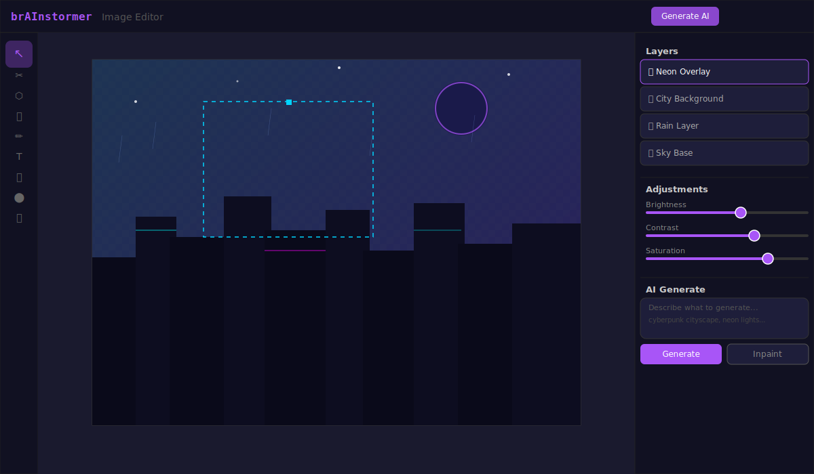
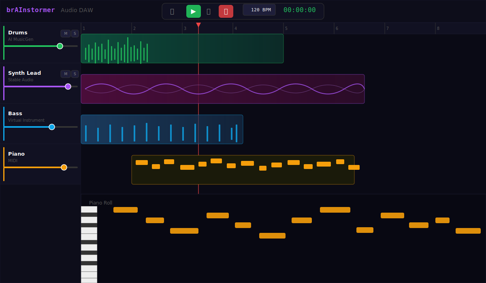
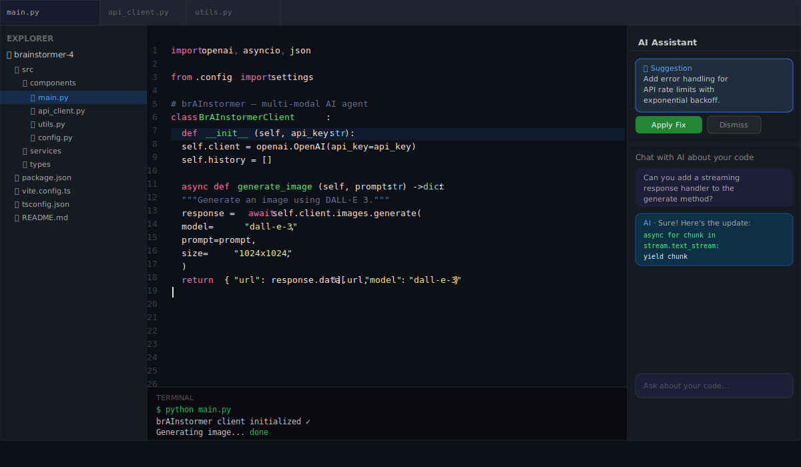

<p align="center">
  
</p>

<p align="center">
  <a href="https://github.com/RhythrosaLabs/brainstormer-4/stargazers"></a>
  <a href="https://github.com/RhythrosaLabs/brainstormer-4/blob/main/LICENSE"></a>
  <a href="#"></a>
  <a href="#"></a>
  <a href="#"></a>
</p>

---

## About

**brAInstormer** is a fully-featured, browser-based creative suite that puts the power of a dozen professional tools behind a single AI-native interface. Think of it as **Photoshop + Logic Pro + VS Code + Notion** — all in one dark-themed app, with every feature supercharged by state-of-the-art AI models.

Whether you're a developer building a prototype, a musician composing a beat, a designer ideating a mood board, or a writer drafting a pitch — brAInstormer gives you every tool you need without ever leaving your browser. Connect your own API keys, keep everything local, and let the AI do the heavy lifting.

> **Zero data sent to our servers.** All AI calls go directly from your browser to the respective AI provider using your own API keys.

---

## Screenshots

### AI Chat — Multi-modal Generation
<p align="center">
  
</p>

Generate text, code, images, and more in a single conversation. Switch between GPT-4o, Claude Sonnet, and Llama 3 mid-thread.

---

### Image Editor — Layer-based AI Design
<p align="center">
  
</p>

A full layer-based image editor with AI generation (DALL·E 3, Stable Diffusion, Flux), inpainting, adjustments, and professional tools — all in the browser.

---

### Audio DAW — Multi-track Production
<p align="center">
  
</p>

Record, sequence, and mix multi-track projects. AI-powered music generation via MusicGen and Stable Audio. Full piano roll for MIDI editing.

---

### Code Editor — AI-Assisted Development
<p align="center">
  
</p>

A syntax-highlighted code editor with an AI pair programmer built in. Ask it to explain, refactor, or extend your code without leaving the editor.

---

## Features

| Category | What's Included |
|---|---|
| 🤖 **AI Chat** | GPT-4o, Claude Sonnet, Llama 3 · file attachments · code highlighting |
| 🎨 **Image Editor** | Layers · brushes · AI generation · inpainting · export |
| 🎬 **Video Editor** | Timeline · AI video gen (Luma, Kling, Stable Video) · effects |
| 🎵 **Audio DAW** | Multi-track · piano roll · AI music gen · MIDI · effects |
| ⬡ **3D Viewer** | AI model generation · textures · scene composition |
| 💻 **Code Editor** | Syntax highlight · AI assistant · terminal · live preview |
| 📝 **Document Editor** | Rich text · markdown · AI writing assist |
| 📊 **Spreadsheet** | Formulas · charts · AI data analysis |
| 📈 **Chart Builder** | 10+ chart types · AI-generated insights |
| 📁 **File Manager** | Drag-and-drop · multi-format viewer |
| 📋 **Project Board** | Kanban · AI task breakdown |
| 📅 **Calendar** | Event management · AI scheduling |

---

## Getting Started

### Prerequisites

- **Node.js 18+** — [Download](https://nodejs.org)
- API keys for the AI services you want to use (all optional — the app works with whichever you provide)

### Installation

```bash
# 1. Clone the repo
git clone https://github.com/RhythrosaLabs/brainstormer-4.git
cd brainstormer-4

# 2. Install dependencies
npm install

# 3. Start the dev server
npm run dev
```

Open [http://localhost:5173](http://localhost:5173) in your browser.

### API Keys Setup

No `.env` file required. Open the app → click **Settings** (⚙️) in the sidebar → paste your API keys. They are saved to `localStorage` only — never transmitted to any server other than the AI provider directly.

| Service | Used For | Get Key |
|---|---|---|
| OpenAI | GPT-4o chat, DALL·E 3 images | [platform.openai.com](https://platform.openai.com) |
| Anthropic | Claude Sonnet chat | [console.anthropic.com](https://console.anthropic.com) |
| Stability AI | Stable Diffusion, Stable Audio, Stable Video | [platform.stability.ai](https://platform.stability.ai) |
| Replicate | 1000+ open-source models | [replicate.com](https://replicate.com) |
| Luma AI | Dream Machine video generation | [lumalabs.ai](https://lumalabs.ai) |

---

## AI Models

### Text & Chat
- **GPT-4o** (OpenAI) — fast, multimodal
- **Claude Sonnet** (Anthropic) — nuanced, long context
- **Llama 3** (Meta via Replicate) — open-source

### Image Generation
- **DALL·E 3** (OpenAI) — prompt accuracy
- **Stable Diffusion 3** (Stability AI) — creative flexibility
- **Flux Pro** (Replicate) — photorealism

### Video Generation
- **Dream Machine** (Luma AI)
- **Stable Video Diffusion** (Stability AI)
- **Kling** (Kling AI via Replicate)

### Audio Generation
- **MusicGen** (Meta via Replicate)
- **Stable Audio** (Stability AI)

### 3D Generation
- **Stable Fast 3D** (Stability AI)

---

## Keyboard Shortcuts

| Shortcut | Action |
|---|---|
| `⌘/Ctrl + K` | Open command palette |
| `⌘/Ctrl + S` | Save |
| `⌘/Ctrl + /` | Toggle help |
| `Space` | Play / Pause (Audio & Video editors) |
| `V` | Move tool (Image Editor) |
| `B` | Brush tool (Image Editor) |
| `T` | Text tool (Image Editor) |
| `R` | Record (Audio DAW) |

---

## Project Structure

```
src/
├── components/         # UI components (per-tool subdirectories)
│   ├── audio-editor/   # Multi-track DAW
│   ├── chat/           # AI chat interface
│   ├── code-editor/    # Code editing + AI assistant
│   ├── image-editor/   # Canvas, layers, tools
│   ├── video-editor/   # Timeline editor
│   └── three-editor/   # 3D scene viewer
├── services/           # API integrations (OpenAI, Stability, etc.)
├── hooks/              # Custom React hooks
├── types/              # TypeScript type definitions
├── utils/              # Helpers and utilities
└── lib/                # API client abstractions
```

---

## Building for Production

```bash
npm run build        # Outputs to dist/
npm run preview      # Serve the production build locally
npm run lint         # ESLint check
```

---

## Contributing

Contributions are welcome! To get started:

1. Fork the repository
2. Create a feature branch (`git checkout -b feat/your-feature`)
3. Commit your changes (`git commit -m 'feat: add your feature'`)
4. Push to the branch (`git push origin feat/your-feature`)
5. Open a Pull Request

Please follow [Conventional Commits](https://www.conventionalcommits.org/) for commit messages.

---

## License

[MIT](LICENSE) © [RhythrosaLabs](https://github.com/RhythrosaLabs)

---

<p align="center">
  Built with ⚡ React · TypeScript · Vite · Tailwind CSS
</p>
